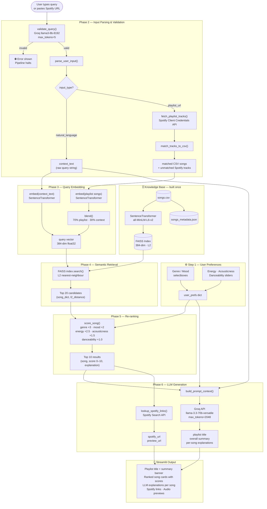
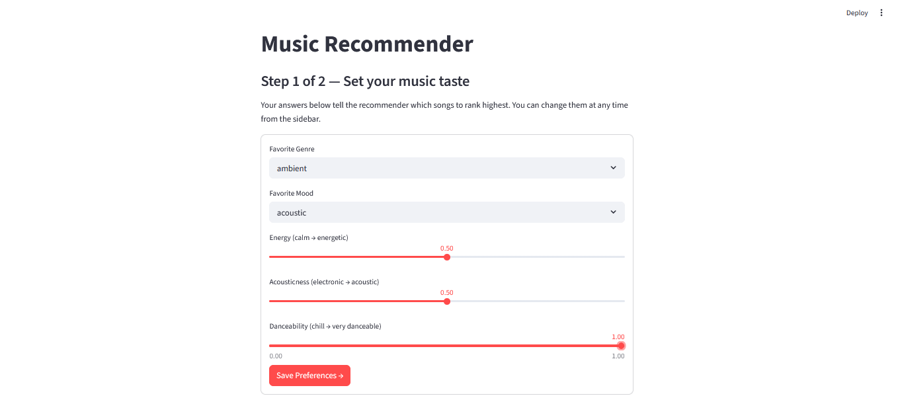
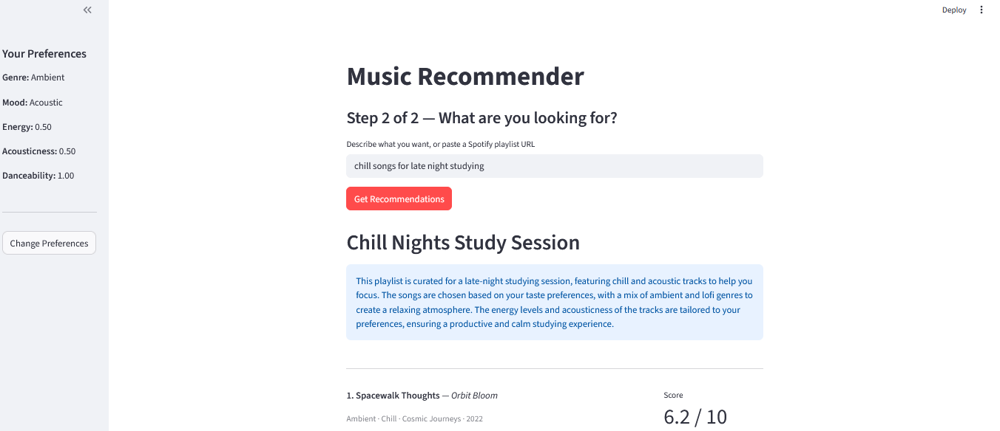
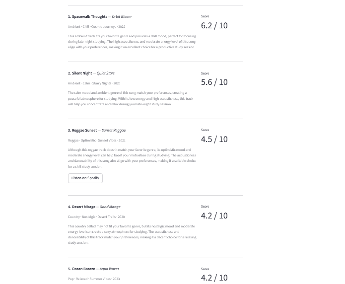

## RAG Pipeline Flowchart

```mermaid
flowchart TD

    subgraph OFFLINE["🗄️ Knowledge Base — built once"]
        CSV[("songs.csv")] --> EMBED_KB["SentenceTransformer\nall-MiniLM-L6-v2"]
        EMBED_KB --> FAISS[("FAISS Index\n384-dim · L2")]
        CSV --> META[("songs_metadata.json")]
    end

    subgraph STEP1["⚙️ Step 1 — User Preferences"]
        GENRE["Genre / Mood\nselectboxes"] & SLIDERS["Energy · Acousticness\nDanceability sliders"] --> PREFS["user_prefs dict"]
    end

    INPUT(["User types query\nor pastes Spotify URL"]) --> GUARD

    subgraph PH2["Phase 2 — Input Parsing & Validation"]
        GUARD["validate_query()\nGroq llama3-8b-8192\nmax_tokens=5"]
        GUARD -->|invalid| STOP["⛔ Error shown\nPipeline halts"]
        GUARD -->|valid| PARSE["parse_user_input()"]
        PARSE --> TYPE{input_type?}
        TYPE -->|natural_language| CTXT["context_text\n(raw query string)"]
        TYPE -->|playlist_url| SPAPI["fetch_playlist_tracks()\nSpotify Client Credentials API"]
        SPAPI --> MATCHCSV["match_tracks_to_csv()"]
        MATCHCSV --> PLDATA["matched CSV songs\n+ unmatched Spotify tracks"]
    end

    subgraph PH3["Phase 3 — Query Embedding"]
        CTXT --> EMBED_NL["embed(context_text)\nSentenceTransformer"]
        PLDATA --> EMBED_PL["embed(playlist songs)\nSentenceTransformer"]
        EMBED_PL --> BLEND["blend()\n70% playlist · 30% context"]
        EMBED_NL --> QVEC["query vector\n384-dim float32"]
        BLEND --> QVEC
    end

    subgraph PH4["Phase 4 — Semantic Retrieval"]
        QVEC --> FSEARCH["FAISS index.search()\nL2 nearest-neighbour"]
        FAISS --> FSEARCH
        FSEARCH --> TOP20["Top 20 candidates\n(song_dict, l2_distance)"]
    end

    subgraph PH5["Phase 5 — Re-ranking"]
        TOP20 --> RSCORE["score_song()\ngenre +3 · mood +2\nenergy +2.5 · acousticness +1.5\ndanceability +1.0"]
        PREFS --> RSCORE
        RSCORE --> TOP10["Top 10 results\n(song, score 0–10, explanation)"]
    end

    subgraph PH6["Phase 6 — LLM Generation"]
        TOP10 --> BPROMPT["build_prompt_context()"]
        PREFS --> BPROMPT
        CTXT --> BPROMPT
        BPROMPT --> GROQ["Groq API\nllama-3.3-70b-versatile\nmax_tokens=2048"]
        GROQ --> LLMOUT["playlist title\noverall summary\nper-song explanations"]
        TOP10 --> SPOTLINKS["lookup_spotify_links()\nSpotify Search API"]
        SPOTLINKS --> URLS["spotify_url\npreview_url"]
    end

    subgraph OUTPUT["🎵 Streamlit Output"]
        LLMOUT & URLS --> UI["Playlist title + summary banner\nRanked song cards with scores\nLLM explanations per song\nSpotify links · Audio previews"]
    end
```

## SAMPLE OUTPUTS 1:

## SAMPLE OUTPUT 2:

